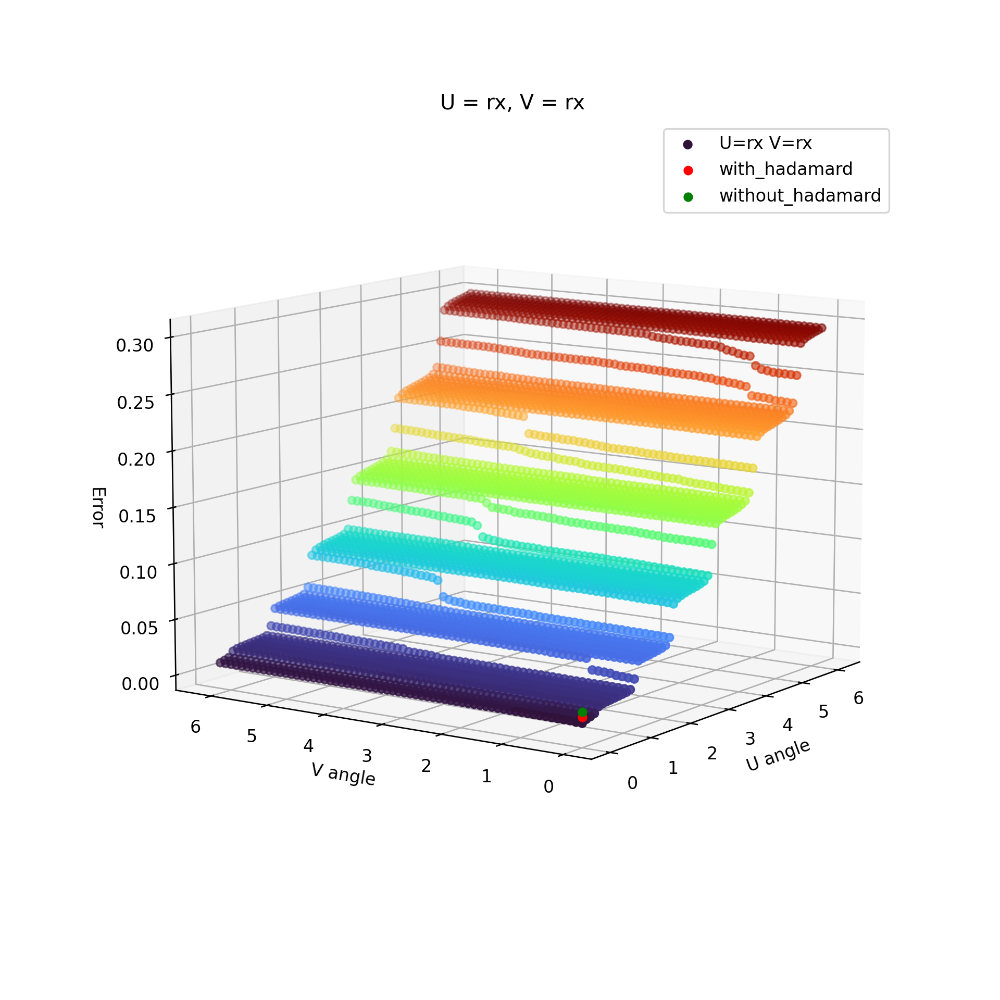
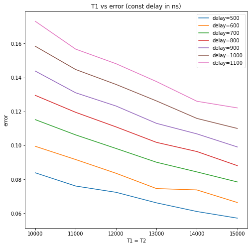
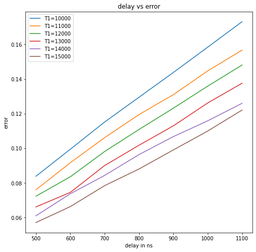
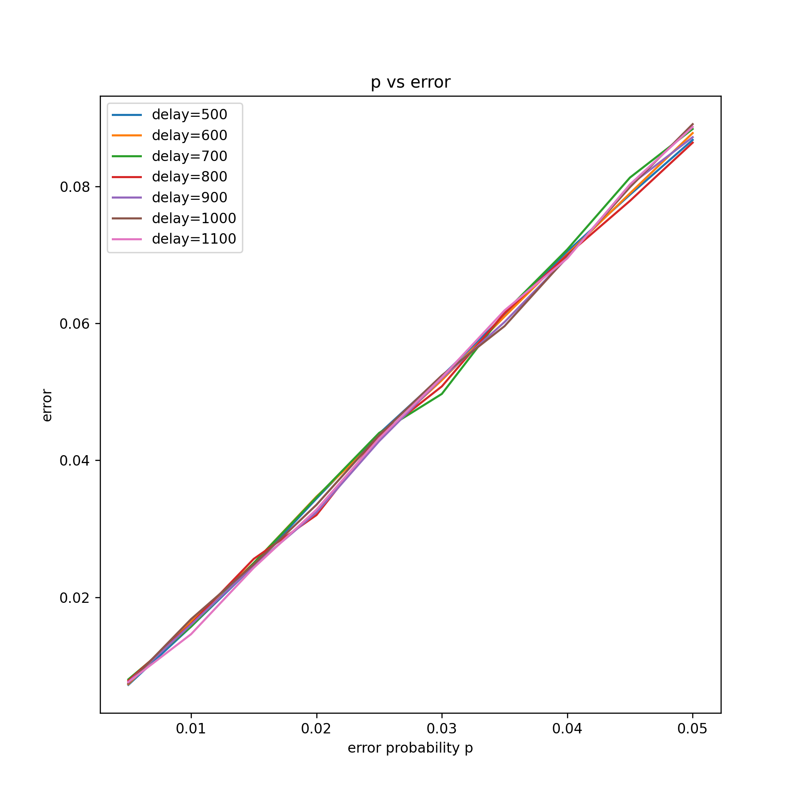
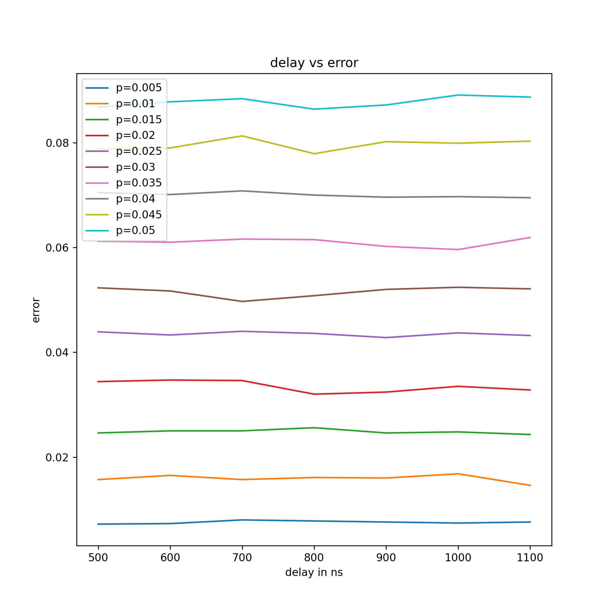
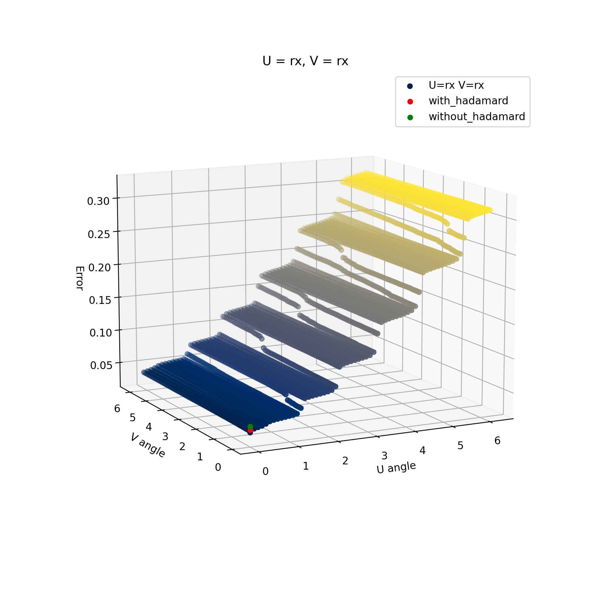

## Some techniques to supress quantum noise

Explorations implementing _"Suppressing decoherence in noisy intermediate-scale quantum processors with unitary operations"_ By _A.S. Mastiukova, M.A. Gavreev, E.O. Kiktenko and A.K. Fedorov_

Suppressing single qubit noise with the help of padding quantum circuits with unitaries $U$ and $V$, over a variety of such possible unitaries.

We have assumed an ideal scenario where there is a delay after the circuit $U_{prep}$. The delay is padded with Uand V. The noise models we are taking are:

1. Depolarisation noise
2. Biased Pauli noise
3. Thermal relaxation noise

We chose a cost function:

## $\frac{\sum |all\ invalid\ states|\ +\ |deviation\ in\ counts\ of\ valid\ states|}{total\ number\ of\ shots}$

For the purpose of this project, we have restricted $U$ and $V$ to $R_x(\theta)$ and $R_y(\theta)$ gates with $\theta$ $\in$ $[0,2\pi)$ with increments of $\frac{\pi}{32}$

By iterating over all possible combinations of $R_x(\theta)$ and $R_y(\theta)$ with $\theta$ varying as mentioned above, we arrive at the following graphs:

Thermal relaxation noise results with different U and V angles

Thermal relaxation noise results with fixed delay

Thermal relaxation noise results with fixed T1=T2

Depolarization noise results with fixed delay

Depolarization noise results with fixed error probability p

Depolarization noise results with different U and V angles

We have concluded the following:

1. Addition of Hadamard Gate may reduce error but in biased Pauli noise model, for our choice of parameters, the error in fact increases.
2. Addition of Hadamard gates may reduce error for depolarisation and thermal relaxation model. But as we see that reduction in error due to some particular Rx(θ) and Ry(θ ) value is not too far from H
3. So far, thermal relaxation noise model has shown the most promise in terms of the amount of noise reduction by applying unitaries
4. Due to the limited time we could not experiment with Rz(θ) gate
