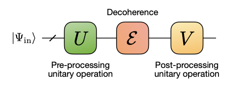

## Some techniques to supress quantum noise

Explorations implementing _"Suppressing decoherence in noisy intermediate-scale quantum processors with unitary operations"_ By _A.S. Mastiukova, M.A. Gavreev, E.O. Kiktenko and A.K. Fedorov_

Suppressing single qubit noise with the help of padding quantum circuits with unitaries U and V, over a variety of such possible unitaries.

