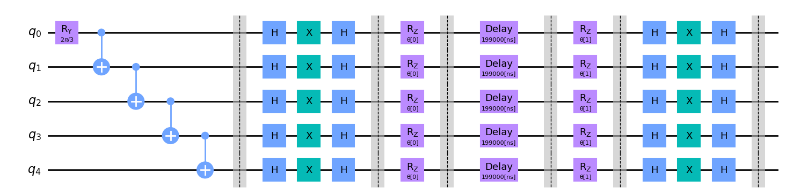
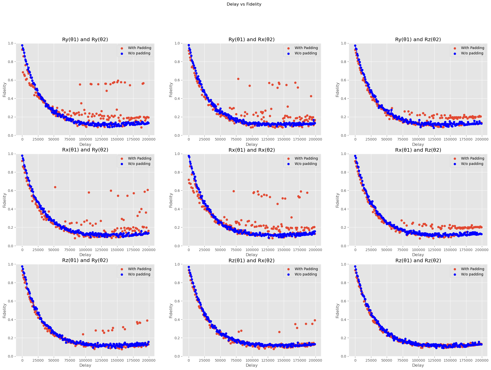
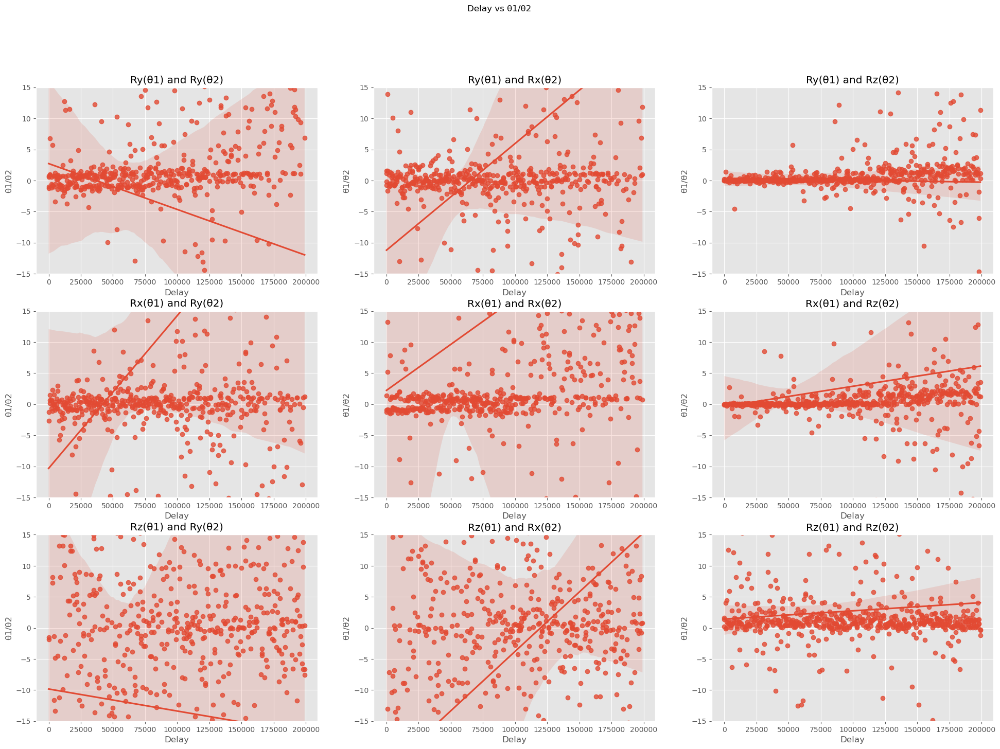
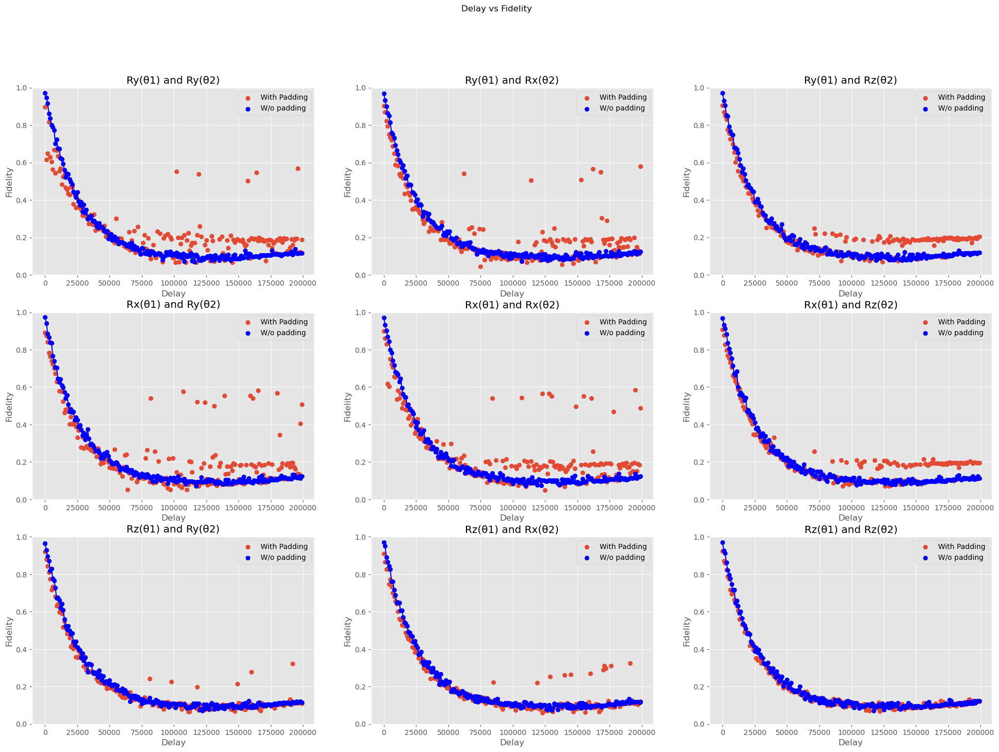
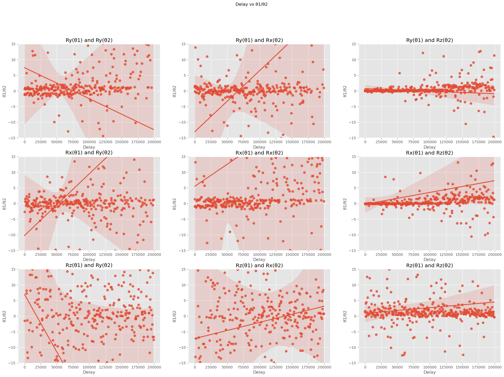

## Noise reduction with the help of padding with U and V gates.

Testing the effect of padding of unitaries $U$ and $V$ on every qubit. 

circuit will look like this:



Parameters which are variable for a given circuit is $\theta_1$ and $\theta_2$

and those parameters are varied for circuits with gates $U,V \in \{R_x,R_y,R_z\}$

And fidelity is calculated and plotted against the baseline (without padding with unitaries)

## Results

### For 5 qubits



And




### For 6 qubits



And



```console
foo@bar$ 
```